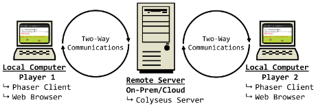

# [atet](https://github.com/atet) / [**_ggj2024_**](https://github.com/atet/ggj2024/blob/main/README.md#atet--ggj2024)

[](#nolink)

# Global Game Jam 2024
## Multi-QWOP-Boost all de wey!!!

This repository is the server companion repository to the client repository for our wacky competitive ***and*** cooperative multiplayer entry for GGJ2024.

----------------------------------------------------------------------------

## Table of Contents

* [0. Preface](#0-preface)
* [1. Requirements](#1-requirements)
* [2. Server Installation](#2-server-installation)
* [3. Client Installation](#3-client-installation)

### Supplemental

* [Troubleshooting](#troubleshooting)
* [Other Resources](#other-resources)

----------------------------------------------------------------------------

## 0. Preface

The following multiplayer test is leveraging the Colyseus multiplayer tutorial below but instead of having the server (Colyseus web server) and client (Phaser game engine) programs running locally on the same computer, we will have the server actually be on a separate computer (can be a cloud instance or just another computer in your network at home).

You can find the original tutorial that installs everything on your local computer at: https://github.com/colyseus/tutorial-phaser

[](#nolink)

As seen above with multiple client computers connecting to a single server, we will:
1. Install the server that multiple players will communicate to in the cloud
2. Install all the client software locally that connects to the server

[Back to Top](#table-of-contents)

----------------------------------------------------------------------------

## 1. Requirements

### Client: Local Computer

* Any computer made in the last decade should do
* This tutorial was developed on Windows 10 with Windows Subsystem for Linux 2 (WSL 2)

### Server: Cloud Instance or Separate Computer in Network

* Instuctions to provision a Linux cloud instance can be found here: https://github.com/atet/ggj2022?tab=readme-ov-file#5-next-steps
* If you end up using another computer within your home network, ensure there is a Linux operating system on it; if it's a Windows 10/11 computer, ensure it has WSL 2
* NOTE: ***Write down the IP address of your server for a later step***

[Back to Top](#table-of-contents)

----------------------------------------------------------------------------

## 2. Server Installation

* We are adapting the Colyseus tutorial to work on a cloud instance server
    * For this tutorial, the cloud instance server is set up with Ubuntu, Docker, and `ufw`

    * Create a new directory `tutorial-phaser`, `cd` into it and create the Dockerfile below: 

```dockerfile
FROM node:20
RUN apt update && apt -y upgrade
RUN apt install -y wget nano tmux htop curl git
RUN git clone https://github.com/colyseus/tutorial-phaser.git
WORKDIR "/tutorial-phaser/server"
RUN npm install
RUN npm audit fix
EXPOSE 2567
```

* We will need to open the port 2567 on the server, here we are using `ufw`

```bash
$ sudo ufw status
$ sudo ufw allow 2567
$ sudo ufw status # Double-check port 2567 is now allowed
```

* We'll build the Docker image, start up a container with the container's port 2567 mapped to the cloud instance's port 2567, and navigate within to start a tmux session and start the Colyseus server

```bash
$ docker image build --network host -t tutorial_image .
$ docker run -dit --restart always -p 2567:2567 --name tutorial_container tutorial_image
$ docker exec -it tutorial_container /bin/bash
# tmux new -s tutorial
# npm start
```

* We are now done with setting up the server
* If you leave the `tmux` session open, you will see in the server console when players joing this server

[Back to Top](#table-of-contents)

----------------------------------------------------------------------------

## 3. Client Installation

* For this tutorial, the client computer is set up with Windows 10 and Windows Subsystem for Linux (Ubuntu)
* On the client computer, you will need to:
    * Clone the git repos
    * Install Node

```bash
$ cd /mnt/d/Users/Athit\ Kao/Desktop/
$ git clone https://github.com/colyseus/tutorial-phaser.git
$ cd tutorial-phaser
$ curl -o- https://raw.githubusercontent.com/nvm-sh/nvm/master/install.sh | bash
## IMPORTANT: Exit and log back in so that `command -v nvm` returns `nvm`

$ nvm ls
## This should list the following meaning that no prior versions of Node are installed
            N/A
iojs -> N/A (default)
node -> stable (-> N/A) (default)
unstable -> N/A (default)

$ nvm install --lts
## The following should return the versions and where they are located
$ node --version
v20.11.0
$ npm --version
10.2.4
$ which node
~/.nvm/versions/node/v20.11.0/bin/node
evo@EVO:~$ which npm
~/.nvm/versions/node/v20.11.0/bin/npm

## Now in a different tab if you didn't tmux this
$ cd /mnt/d/Users/Athit\ Kao/Desktop/tutorial-phaser/client
$ npm install
$ npm audit fix
```

* We will now need to let the client know what the server's IP address is
* In client file `tutorial-phaser\client\src\backend.ts`, change line 3 from `localhost` to your server's IP address:

```bash
3    : "ws://localhost:2567"
```

to

```bash
3    : "ws://<SERVER_IP>:2567"
```

* You will have to start the client program in you command line interface and have it running while you are using the tutorial "game"

```bash
$ npm start
```

* The client should be running on port 1234; so open a web browser and go to http://localhost:1234
* NOTE: An additional player appears in the room (picking options 1-4 corresponds to different rooms) for every browser tab you have visiting the client

[Back to Top](#table-of-contents)

----------------------------------------------------------------------------

## Troubleshooting

Issue | Solution
--- | ---
**"It's not working!"** | This concise tutorial has distilled hours of sweat, tears, and troubleshooting; _it can't not work_

[Back to Top](#table-of-contents)

----------------------------------------------------------------------------

## Other Resources

[Back to Top](#table-of-contents)

----------------------------------------------------------------------------

<p align="center">Copyright © 2024-∞ Athit Kao, <a href="http://www.athitkao.com/tos.html" target="_blank">Terms and Conditions</a></p>