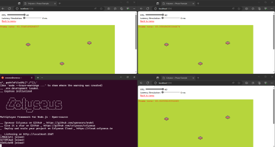
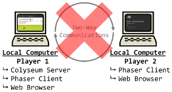

# [atet](https://github.com/atet) / [**_ggj2024_**](https://github.com/atet/ggj2024/blob/main/README.md#atet--ggj2024)

[](#nolink)

# Global Game Jam 2024
## Multi-QWOP-Boost all de wey!!!

This repository is the server companion repository to the client repository for our wacky competitive ***and*** cooperative multiplayer entry for GGJ2024.

----------------------------------------------------------------------------

## Table of Contents

* [0. Preface](#0-preface)
* [1. Requirements](#1-requirements)
* [2. Server Installation](#2-server-installation)
* [3. Client Installation](#3-client-installation)

### Supplemental

* [Troubleshooting](#troubleshooting)
* [Other Resources](#other-resources)

----------------------------------------------------------------------------

## 0. Preface

The following multiplayer test is leveraging the Colyseus multiplayer tutorial below but instead of having the server (Colyseus web server) and client (Phaser game engine) programs running locally on the same computer, we will have the server actually be on a separate computer (can be a cloud instance or just another computer in your network at home).

[](#nolink)

As seen above with multiple client computers connecting to a single server, we will:
1. Install the server that multiple players will communicate to in the cloud
2. Install all the client software locally that connects to the server

[Back to Top](#table-of-contents)

----------------------------------------------------------------------------

## 1. Requirements

### Client: Local Computer

* Any computer made in the last decade should do
* This tutorial was developed on Windows 10 with Windows Subsystem for Linux 2 (WSL 2)

### Server: Cloud Instance or Separate Computer in Network

* Instuctions to provision a Linux cloud instance can be found here: https://github.com/atet/ggj2022?tab=readme-ov-file#5-next-steps
* If you end up using another computer within your home network, ensure there is a Linux operating system on it; if it's a Windows 10/11 computer, ensure it has WSL 2
* NOTE: ***Write down the IP address of your server for a later step***

[Back to Top](#table-of-contents)

----------------------------------------------------------------------------

## 2. Server Installation

* For this tutorial, we are adapting the Colyseus tutorial to work on a remote server
* This tutorial used a cloud instance server set up with Ubuntu operating system
* SSH into your remote server and run the following commands:

```bash
$ cd ~
$ git clone https://github.com/colyseus/tutorial-phaser.git
$ cd tutorial-phaser
$ curl -o- https://raw.githubusercontent.com/nvm-sh/nvm/master/install.sh | bash
```

* **IMPORTANT: You must exit and log back into your Linux user so that some changes take effect**
* Once you log back in, we will confirm that no prior version of Node was installed and install Node

```bash
$ nvm ls
## This should list the following results, meaning that no prior versions of Node are installed
            N/A
iojs -> N/A (default)
node -> stable (-> N/A) (default)
unstable -> N/A (default)

## This may take a few minutes to install
$ nvm install --lts
```

* Once Node is installed, see if all the software is ready by checking their versions and where they are located

```bash
## The following should return the versions and where they are located
$ node --version
v20.11.0
$ npm --version
10.2.4
$ which node
~/.nvm/versions/node/v20.11.0/bin/node
evo@EVO:~$ which npm
~/.nvm/versions/node/v20.11.0/bin/npm
```

* We will now install and run the Colyseus server

```
$ cd ~/tutorial-phaser/server
$ npm install
$ npm audit fix
$ npm start
       ___      _
      / __\___ | |_   _ ___  ___ _   _ ___
     / /  / _ \| | | | / __|/ _ \ | | / __|
    / /__| (_) | | |_| \__ \  __/ |_| \__ \
    \____/\___/|_|\__, |___/\___|\__,_|___/
                  |___/

Multiplayer Framework for Node.js · Open-source

__ Sponsor Colyseus on GitHub _ https://github.com/sponsors/endel
__ Give it a star on GitHub _ https://github.com/colyseus/colyseus
_  Deploy and scale your project on Colyseus Cloud _ https://cloud.colyseus.io

_  Listening on http://localhost:2567
```

**The server is now listening on port 2567 and ready for connections**

### Firewall

You may need to open port 2567 on the server, here we are using the UncomplicatedFirewall (`ufw`):

```bash
$ sudo ufw status
$ sudo ufw allow 2567
$ sudo ufw status # Double-check port 2567 is now allowed
```

[Back to Top](#table-of-contents)

----------------------------------------------------------------------------

## 3. Client Installation

* For this tutorial, the client computer is set up with Windows 10 and Windows Subsystem for Linux (Ubuntu)
* On the client computer, you will perform almost identical actions as the server instalation:
    * Clone the Colyseus & Phaser tutorial `git` repos
    * Install Node
    * Start client Phaser code

```bash
$ cd ~
$ git clone https://github.com/colyseus/tutorial-phaser.git
$ cd tutorial-phaser
$ curl -o- https://raw.githubusercontent.com/nvm-sh/nvm/master/install.sh | bash
## IMPORTANT: You must exit and log back into your Linux user so that some changes take effect

$ nvm ls
            N/A
iojs -> N/A (default)
node -> stable (-> N/A) (default)
unstable -> N/A (default)

$ nvm install --lts

$ node --version
v20.11.0
$ npm --version
10.2.4
$ which node
~/.nvm/versions/node/v20.11.0/bin/node
evo@EVO:~$ which npm
~/.nvm/versions/node/v20.11.0/bin/npm

$ cd ~/tutorial-phaser/client
$ npm install
$ npm audit fix
```

* We will now need to let the client know what the server's IP address is
* In client file `~\tutorial-phaser\client\src\backend.ts`, change line 3 from `localhost` to your server's IP address:

```bash
3    : "ws://localhost:2567"
```

to

```bash
3    : "ws://<SERVER_IP>:2567"
```

* You will have to start the client program in you command line interface and have it running while you are using the tutorial "game"

```bash
$ npm start

> client@1.0.0 start
> parcel serve index.html

Server running at http://localhost:1234
✨ Built in 16ms
```

**The client should be running on port 1234; so open a web browser and go to http://localhost:1234 to see the multiplayer server in action!**


[](#nolink)

NOTE: Additional players appear in the room (picking options 1-4 corresponds to different rooms) for every browser tab you have visiting the Phaser client (http://localhost:1234)

[Back to Top](#table-of-contents)

----------------------------------------------------------------------------

## Troubleshooting

Issue | Solution
--- | ---
**"Installed Phaser client on server and cannot connect to server through game"** | "Headless" Phaser configuration is not covered here, see [Headless Phaser](#headless-phaser) for more info
**"Cannot connect to server/client!"** | You may also have to adjust your firewall settings to allow port 2567 (on the server) to be accessed externally, see [Firewall](#firewall)
**"It's not working!"** | This concise tutorial has distilled hours of sweat, tears, and troubleshooting; _it can't not work_

[Back to Top](#table-of-contents)

----------------------------------------------------------------------------

## Other Resources

### Single Computer Installation

The original Colyseum tutorial installs both server and client on the same local computer. Since it is typically not advised to open your personal computer's ports to others, others should not connect to your computer for multiplayer capability.

[](#nolink)

The instructions presented here have been adapted from that single-computer Colyseum tutorial which can be found at: https://github.com/colyseus/tutorial-phaser

### Containerization

* If you would like to containerize your server, you must have Docker installed
    * More info about Docker here: https://github.com/atet/learn/tree/master/virtual
* Create a new directory `tutorial-phaser`, `cd` into it and create the Dockerfile below: 
    * NOTE: There may be many different ways to install Node.js through Dockerfile, but it is easiest to just use the offical Node Docker image

```dockerfile
FROM node:20
RUN apt update && apt -y upgrade
RUN apt install -y wget nano tmux htop curl git
RUN git clone https://github.com/colyseus/tutorial-phaser.git
WORKDIR "/tutorial-phaser/server"
RUN npm install
RUN npm audit fix
EXPOSE 2567
```

* We'll build the Docker image, start up a container with the container's port 2567 mapped to the cloud instance's port 2567, and navigate within the container to start a `tmux` session and start the Colyseus server

```bash
$ docker image build --network host -t tutorial_image .
$ docker run -dit --restart always -p 2567:2567 --name tutorial_container tutorial_image
$ docker exec -it tutorial_container /bin/bash
# tmux new -s tutorial
# npm start
```

* We are now done with setting up the server container
* If you leave the `tmux` session open, you will see in the server console when players joing this server

### Headless Phaser

* The current instructions must have the client program running locally, otherwise you will have to adapt the Phaser game engine for "headless" operation
    * More info here: https://medium.com/@16patsle/running-phaser-3-on-the-server-4c0d09ffd5e6

[Back to Top](#table-of-contents)

----------------------------------------------------------------------------

<p align="center">Copyright © 2024-∞ Athit Kao, <a href="http://www.athitkao.com/tos.html" target="_blank">Terms and Conditions</a></p>